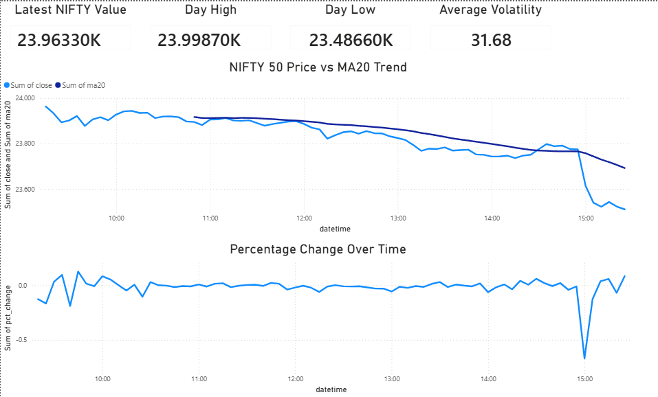
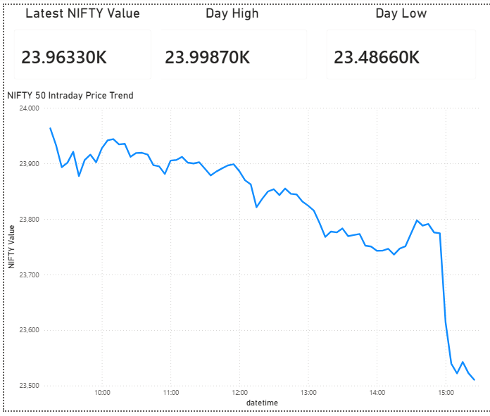
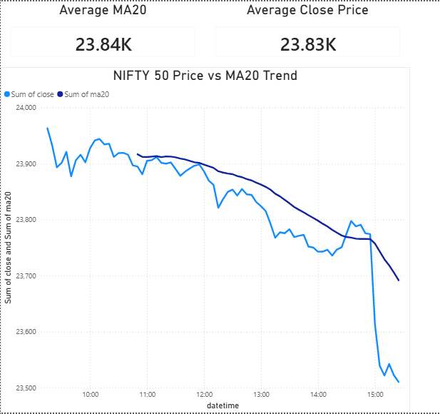
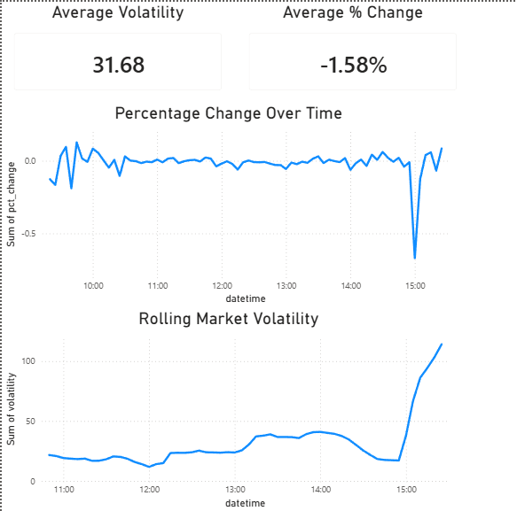
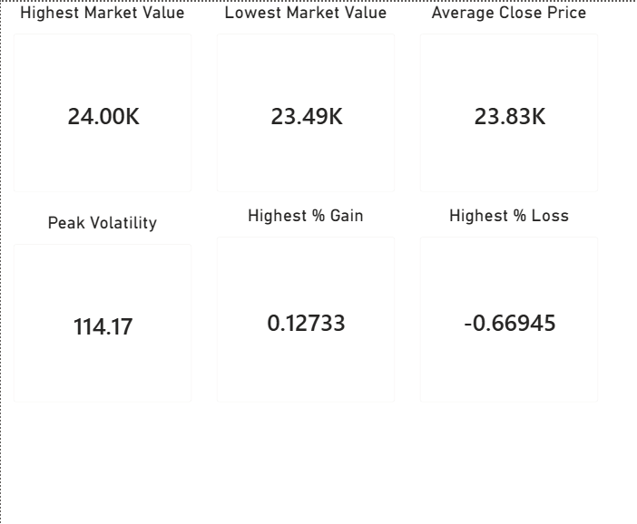
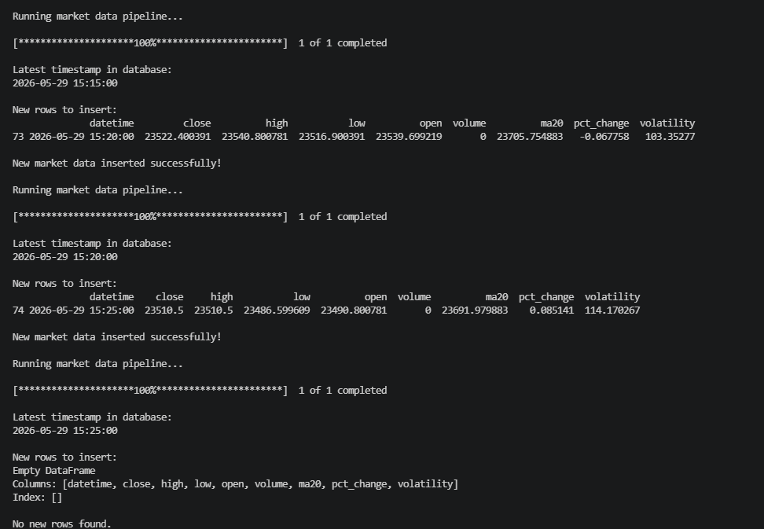

# Market Analytics Dashboard

An automated market analytics dashboard built using Python, MySQL, and Power BI for tracking and analyzing NIFTY 50 market data.

The project fetches intraday market data, performs analytical processing, stores the processed data into MySQL, and visualizes insights through interactive Power BI dashboards.

---

## Project Highlights

* End-to-end automated analytics pipeline
* Incremental data ingestion with duplicate prevention
* MySQL-backed market data storage
* Multi-page Power BI reporting solution
* Scheduler-based automated updates
* Executive dashboard for market monitoring


---

# Features

- Automated market data fetching using Yahoo Finance API
- Incremental data ingestion into MySQL
- Moving average trend analysis
- Market volatility analytics
- Percentage change analysis
- Multi-page Power BI dashboard
- Automated scheduler-based pipeline execution
- Executive-level KPI reporting

---

# Tech Stack

| Component | Technology |
|---|---|
| Programming Language | Python |
| Database | MySQL |
| Data Visualization | Power BI |
| Data Processing | Pandas, NumPy |
| Data Source | Yahoo Finance API |
| Automation | Python Schedule Library |
| Database Connectivity | SQLAlchemy, PyMySQL |

---

# System Architecture

```text
Yahoo Finance API
        ↓
Python ETL Pipeline
        ↓
Analytical Processing
        ↓
MySQL Database
        ↓
Power BI Dashboard
```

---

# Workflow

1. Fetch intraday NIFTY 50 market data using Yahoo Finance API
2. Process and clean the dataset
3. Generate analytical indicators
4. Store processed records into MySQL
5. Prevent duplicate insertions using incremental ingestion logic
6. Visualize insights in Power BI dashboards
7. Automatically update the pipeline using scheduler automation

---

# Dashboard Pages

## 1. Market Overview
- Latest NIFTY value
- Day high and low
- Intraday price trend

## 2. Trend Analytics
- Price vs Moving Average (MA20)
- Trend interpretation analytics

## 3. Volatility Analysis
- Percentage change over time
- Rolling market volatility analysis

## 4. Performance Metrics
- Peak volatility
- Highest and lowest market values
- Market movement summaries

## 5. Executive Dashboard
- Consolidated analytical overview
- KPI-focused market summary
- Combined trend and movement analytics

---

# Project Structure

```text
market-analytics-dashboard/
│
├── dashboard/
│   └── market_analytics_dashboard.pbix
│
├── data_pipeline/
│   ├── fetch_data.py
│   ├── indicators.py
│   ├── process_data.py
│   └── scheduler.py
│
├── database/
│   ├── db_connect.py
│   └── schema.sql
│
├── screenshots/
│
├── requirements.txt
├── README.md
└── .gitignore
```

---

# How to Run

## 1. Clone Repository

```bash
git clone https://github.com/Aysh2171/market-analytics-dashboard.git
cd market-analytics-dashboard
```

---

## 2. Create Virtual Environment

```bash
python -m venv venv
```

### Activate Virtual Environment

#### Windows

```bash
venv\Scripts\activate
```

---

## 3. Install Dependencies

```bash
pip install -r requirements.txt
```

---

# 4. Configure MySQL Database

Create a MySQL database named:

```text
market_dashboard
```

Then update your MySQL credentials inside:

```text
data_pipeline/fetch_data.py
```

Modify the following fields according to your local MySQL configuration:

```python
username = "your_username"
password = "your_password"
host = "localhost"
database = "market_dashboard"
```

## 5. Run Data Pipeline

```bash
python data_pipeline/fetch_data.py
```

---

## 6. Start Scheduler Automation

```bash
python data_pipeline/scheduler.py
```

---

## 7. Open Power BI Dashboard

Open:

```text
dashboard/market_analytics_dashboard.pbix
```

Refresh the dataset to visualize updated market analytics.

---

# Future Improvements

- Live market streaming integration
- Additional technical indicators
- Cloud deployment
- Alerting and anomaly detection
- Advanced market analytics

---

# Screenshots

## Executive Dashboard



---

## Market Overview



---

## Trend Analytics



---

## Volatility Analysis



---

## Performance Metrics



---

## Automated Data Pipeline


